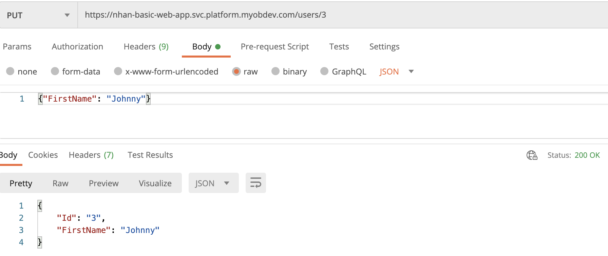

# Frameworkless Basic Web Application

[](https://buildkite.com/myob/nhan-frameworkless-web-app)

## Overview 
This application is a basic REST API which fulfils the requirements of the [Frameworkless Basic Web Application kata](https://github.com/MYOB-Technology/General_Developer/tree/main/katas/kata-frameworkless-basic-web-application). It is containerized using Docker and the image is hosted using Amazon Web Services' Elastic Container Registry. The application was deployed using Jupiter.  

## Usage

### System Requirements

* [Postman](https://www.postman.com/) or another tool of choice (e.g. `cURL`) to interact with the API
* MacOS users can install Postman using the `Homebrew` package manager with the following command: `brew cask install postman`

### Accessing the Home Page  
**HTTP Method:** GET  
**Url:** 
https://nhan-basic-web-app.svc.platform.myobdev.com/  

**Expected Response:**  
The home page will display a greeting to the users loaded from a database.  
  

### Viewing a list of users  

**HTTP Method:** GET  
**Url:** 
https://nhan-basic-web-app.svc.platform.myobdev.com/users  

**Expected Response:**  
The list of users will display in JSON format  
  

### Viewing information for one user  

**HTTP Method:** GET  
**Url Format:** 
`https://nhan-basic-web-app.svc.platform.myobdev.com/<UserId>` 

**Expected Response:**  
The information for a user will display in JSON format
  

### Adding a user  

**HTTP Method:** POST  
**Url:** 
https://nhan-basic-web-app.svc.platform.myobdev.com/users  
**Request requirements:**  
The request body is required to be in JSON format. Only the `FirstName` key-pair is required to create a new user.   

**Expected Response:**  
The server will respond with a success message if the user has been added successfully. The location to the new resource can be found in the `Location` header.  
  

  

### Removing a user  

**HTTP Method:** DELETE  
**Url Format:** 
`https://nhan-basic-web-app.svc.platform.myobdev.com/<UserId>` 

**Expected Response:**  
A success message will display if the user has been successfully deleted
  

### Changing a user's name

**HTTP Method:** PUT  
**Url Format:** 
`https://nhan-basic-web-app.svc.platform.myobdev.com/<UserId>`  
**Request requirements:**  
The request body is required to be in JSON format. Only the `FirstName` key-pair is required to update a user's name.     

**Expected Response:**  
The updated user details will be displayed in JSON format
 

## Custom Error Messages  

### User does not exist  
This error message will display if you attempt to access a user whose ID does not exist in the database.  
Possible reasons for this error:  
* The ID provided is incorrect
* The user has been deleted

  

### Name already exists  
This error message will display if you attempt to create a new user or update the name of a user where an existing user already has the same name.
The business rules require that each user's name must be unique.  

  

### Name cannot be empty 
This error message will display if you attempt to create a new user without specifying a first name.  

  

### Forbidden  
The owner of the application is `Nhan`, therefore this user cannot be deleted. You will receive a `Forbidden` response from the server if you attempt to delete this user.  

  


## Running the tests on your local machine  

### System Requirements

* A command line interface (CLI) such as ```Command Prompt``` for Windows or ```Terminal``` for macOS
* [Docker](https://www.docker.com/) 

### Installation

1. Download the repository or clone to your computer using the ```git clone``` command
2. In the CLI, navigate into the folder containing the solution and run the command `sh ops/scripts/test.sh test`.
Note: the `test` argument is used as the image tag and can be substituted with a tag of your choosing.  

The shell script will build the image and run the tests in a container on your local machine.

## Running the application on your local machine

### System Requirements
* A command line interface (CLI) such as ```Command Prompt``` for Windows or ```Terminal``` for macOS
* [.Net Core 3.1 SDK](https://dotnet.microsoft.com/download) or later.
If you have ```homebrew``` you can install the latest version of the .NET Core SDK by running the command ```brew cask install dotnet-sdk``` in the CLI
* [AWS CLI 2](https://docs.aws.amazon.com/cli/latest/userguide/install-cliv2.html) 

### Steps
1. Download or clone the repository to your computer using the `git clone` command.  
2. `cd` into the root directory of the project.
3. Run this command to set up the environment variables and start up the local database: `. ./ops/scripts/local_startup.sh`
4. When the table has been created, type `:q` to escape the `describe-table` output.  
5. When the data has been written to the table, type `:q` again to escape the output and return to the command line.
6. In the same terminal session, run the command `dotnet restore` to restore the packages.  
6. In the same terminal session, run the command `dotnet run --project src/kata_frameworkless_web_app` to start the application.  

## Dependecies
* [Docker](https://www.docker.com/)
* [AWS CLI 2](https://docs.aws.amazon.com/cli/latest/userguide/install-cliv2.html) 
* [XUnit](https://xunit.net/)
* [Moq](https://github.com/Moq/moq4/wiki/Quickstart)


